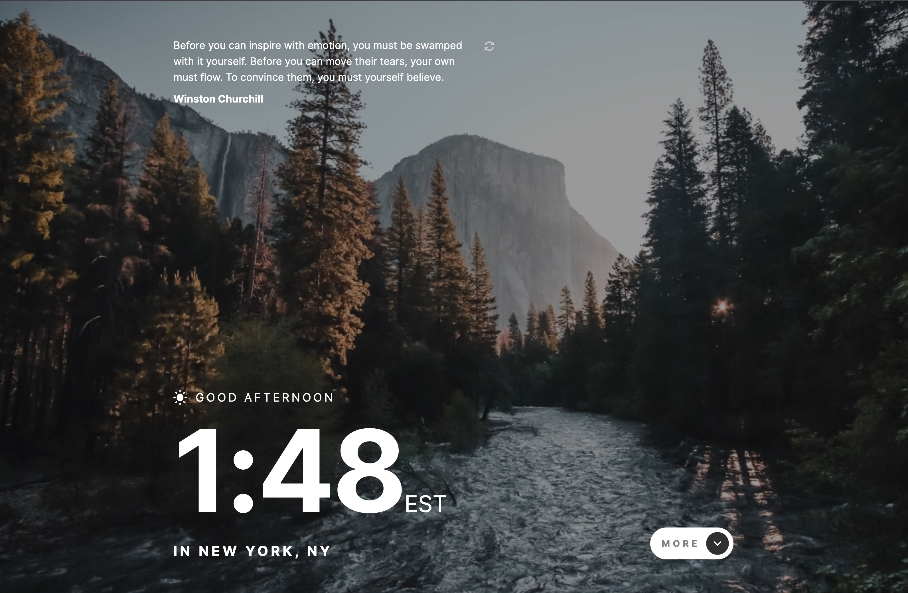

# Frontend Mentor - Clock app solution

This is a solution to the [Clock app challenge on Frontend Mentor](https://www.frontendmentor.io/challenges/clock-app-LMFaxFwrM). Frontend Mentor challenges help you improve your coding skills by building realistic projects.

## Table of contents

- [Overview](#overview)
  - [The challenge](#the-challenge)
  - [Screenshot](#screenshot)
  - [Links](#links)
- [My process](#my-process)
  - [Built with](#built-with)
  - [What I learned](#what-i-learned)
  - [Continued development](#continued-development)
  - [Useful resources](#useful-resources)
- [Author](#author)
- [Acknowledgments](#acknowledgments)

**Note: Delete this note and update the table of contents based on what sections you keep.**

## Overview

### The challenge

Users should be able to:

- View the optimal layout for the site depending on their device's screen size
- See hover states for all interactive elements on the page
- View the current time and location information based on their IP address
- View additional information about the date and time in the expanded state
- Be shown the correct greeting and background image based on the time of day they're visiting the site
- Generate random programming quotes by clicking the refresh icon near the quote

### Screenshot

### Links

- Solution URL: [https://www.frontendmentor.io/challenges/clock-app-LMFaxFwrM/hub/clock-app-Ch4Qg71vu](https://www.frontendmentor.io/challenges/clock-app-LMFaxFwrM/hub/clock-app-Ch4Qg71vu)
- Live Site URL: [https://vigilant-torvalds-bde94c.netlify.app/](https://vigilant-torvalds-bde94c.netlify.app/)

## My process

### Built with

- Semantic HTML5 markup
- CSS custom properties
- Flexbox
- CSS Grid
- Mobile-first workflow
- [Vue JS](https://vuejs.org/) - JS library

**Note: These are just examples. Delete this note and replace the list above with your own choices**

### What I learned

I learned how to use the composition API for VueJS. It was a great challenge and I hope to get really familiar with this framework and it's patterns.

### Continued development

I really need to focus on how to write cleaner jS. VueJS in particular is very easy to get started and there is tons of information online on how to write simple applications.

### Useful resources

- [YouTube](https://www.youtube.com) - YouTube is always open and it's really easy to learn how other people approach code.
- [VueJS](https://vuejs.org/) - For this project I constantly went back to learn all the ins and out of Vue.
- [VueSchool.io](https://vueschool.io/) - For this project I constantly went back to learn all the ins and out of Vue.

## Author

- Website - [Manuel Pena](https://www.mannydevelops.com/)
- Frontend Mentor - [@manolobrown](https://www.frontendmentor.io/profile/manolobrown)
- Twitter - [@manolobrown](https://www.twitter.com/manolobrown)
